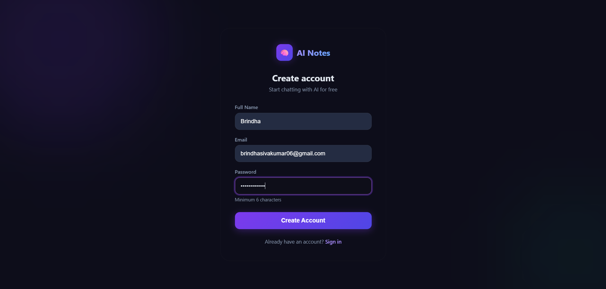
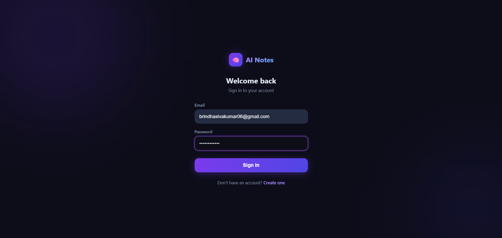
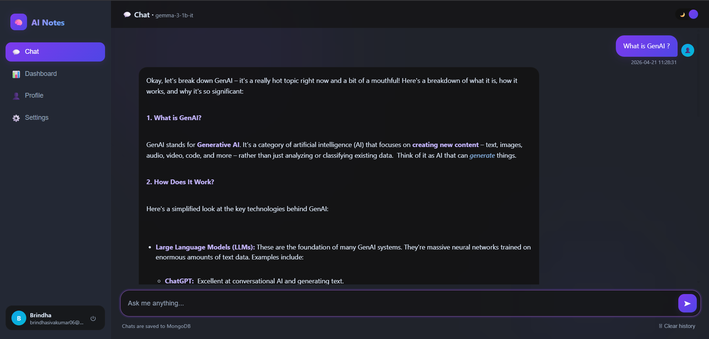
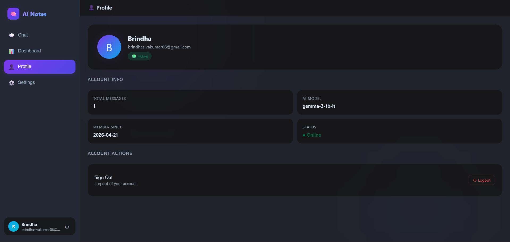

# AI Notes App

A full-stack AI-powered chat application built with FastAPI, MongoDB Atlas, and a local LLM (Gemma 3 via llama.cpp).

---

## Features

- User authentication — Register, Login, Logout
- Chat with a local LLM (Gemma 3 1B via llama-server)
- Chat history saved per user in MongoDB Atlas
- Dashboard with stats and recent conversations
- Profile page with account info
- Dark / Light theme toggle
- Markdown rendering in AI responses

---

## Screenshots

### Register


### Login


### Chat


### Profile



---

## Project Structure

```
ai-notes/
├── app.py
├── .env
├── requirements.txt
├── templates/
│   ├── index.html
│   ├── login.html
│   └── register.html
├── screenshots/
└── README.md
```

---

## Setup

### 1. Install dependencies
```bash
pip install -r requirements.txt
```

### 2. Configure `.env`
```env
MONGO_URI=mongodb+srv://<user>:<password>@cluster.mongodb.net/
GEMINI_API_KEY=your_key_here
```

### 3. Start the local LLM server
```bash
llama-server -hf ggml-org/gemma-3-1b-it-GGUF --port 8080
```

### 4. Run the app
```bash
python app.py
```

Open http://127.0.0.1:8000

---

## Tech Stack

| Layer     | Technology                          |
|:---------:|:----------------------------------:|
| Backend   | Python, FastAPI                    |
| Frontend  | HTML, CSS, Jinja2                  |
| Database  | MongoDB Atlas                      |
| AI Model  | Local LLM / Gemini API             |
| Auth      | Session Cookies, SHA-256           |

---

## Database Design

The application uses MongoDB to store user data and conversation history. The database is structured into two main collections.

### users Collection

Stores user account details.

| Field    | Type   | Description              |
|:--------:|:------:|:------------------------:|
| name     | string | Full name of the user    |
| email    | string | Unique email address     |
| password | string | SHA-256 hashed password  |
| joined   | string | Registration date        |

---

### notes Collection

Stores user messages and AI responses.

### notes Collection

| Field     | Type   | Description                  |
|:---------:|:------:|:----------------------------:|
| user_id   | string | Reference to the user        |
| message   | string | User input message           |
| response  | string | AI-generated response        |
| timestamp | string | Date and time of interaction |

---

## Data Flow

1. User enters a message through the web interface  
2. Request is sent to FastAPI backend  
3. Backend processes input using AI model  
4. Response is generated  
5. Message and response are stored in MongoDB  
6. Chat history is retrieved and displayed  

---

## Security

- Passwords are hashed using SHA-256  
- Sensitive data such as API keys and database URIs are stored in environment variables (`.env`)  
- No credentials are hardcoded in the application  

---

## Example Data (MongoDB Document)

```json
{
  "message": "What is AI?",
  "response": "Artificial Intelligence is the simulation of human intelligence by machines.",
  "timestamp": "2026-04-21 10:30:00"
}
```